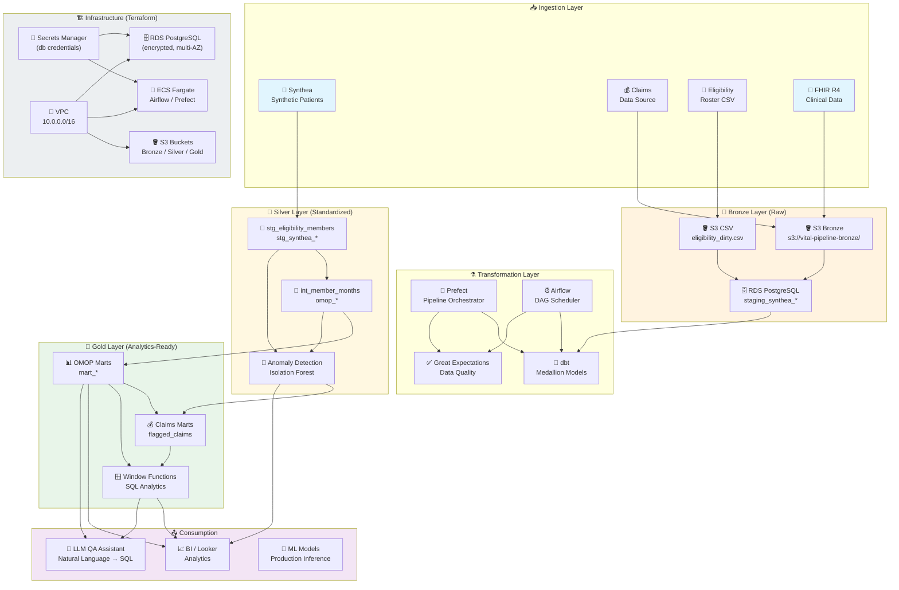
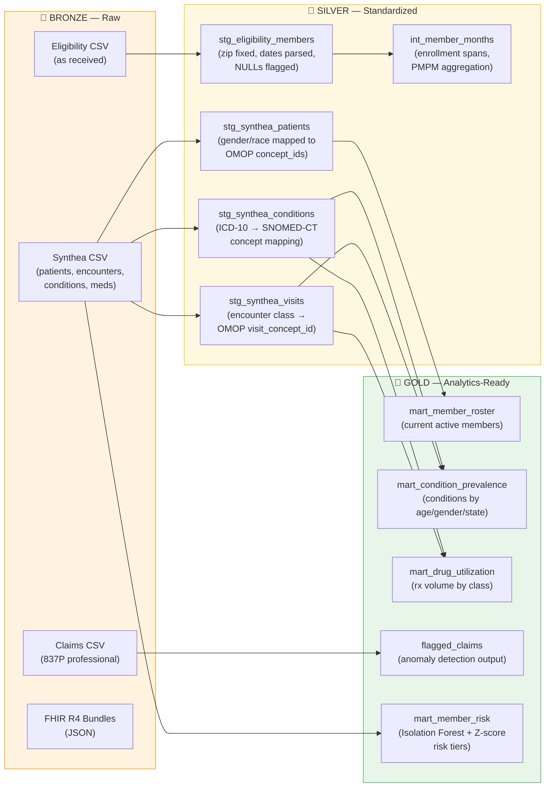
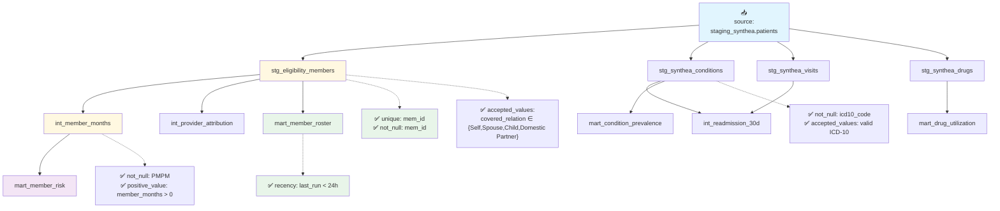
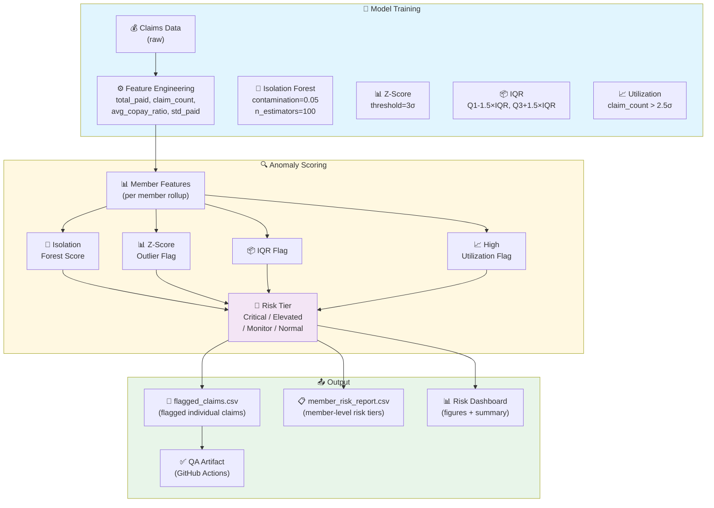
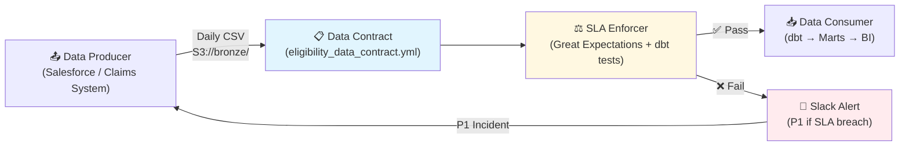

# vital-pipeline — Architecture

## System Architecture

```mermaid
flowchart TB
    subgraph Ingestion["📥 Ingestion Layer"]
        Synthea["🧊 Synthea\nSynthetic Patients"]
        Claims["💰 Claims\nData Source"]
        Eligibility["👤 Eligibility\nRoster CSV"]
        FHIRR4["🏥 FHIR R4\nClinical Data"]
    end

    subgraph Bronze["🥉 Bronze Layer (Raw)"]
        S3Bronze["🪣 S3 Bronze\ns3://vital-pipeline-bronze/"]
        RDS["🗄️ RDS PostgreSQL\nstaging_synthea_*"]
        S3BronzeCSV["🪣 S3 CSV\neligibility_dirty.csv"]
    end

    subgraph Transformation["⚗️ Transformation Layer"]
        Prefect["🔄 Prefect\nPipeline Orchestrator"]
        Airflow["⏰ Airflow\nDAG Scheduler"]
        GX["✅ Great Expectations\nData Quality"]
        DBT["🔧 dbt\nMedallion Models"]
    end

    subgraph Silver["🥈 Silver Layer (Standardized)"]
        DBTStaging["📄 stg_eligibility_members\nstg_synthea_*"]
        DBTInt["📄 int_member_months\nomop_*"]
        Anomaly["🤖 Anomaly Detection\nIsolation Forest"]
    end

    subgraph Gold["🥇 Gold Layer (Analytics-Ready)"]
        Marts["📊 OMOP Marts\nmart_*"]
        WindowSQL["🪟 Window Functions\nSQL Analytics"]
        ClaimsMart["💰 Claims Marts\nflagged_claims"]
    end

    subgraph Consumption["📤 Consumption"]
        LLMQA["💬 LLM QA Assistant\nNatural Language → SQL"]
        Dashboard["📈 BI / Looker\nAnalytics"]
        MLOps["🤖 ML Models\nProduction Inference"]
    end

    subgraph Infrastructure["🏗️ Infrastructure (Terraform)"]
        VPC["🔐 VPC\n10.0.0.0/16"]
        RDSInstance["🗄️ RDS PostgreSQL\n(encrypted, multi-AZ)"]
        S3All["🪣 S3 Buckets\nBronze / Silver / Gold"]
        ECS["🐳 ECS Fargate\nAirflow / Prefect"]
        Secrets["🔑 Secrets Manager\n(db credentials)"]
    end

    %% Data flows
    Synthea --> DBTStaging
    Claims --> S3Bronze
    Eligibility --> S3BronzeCSV
    FHIRR4 --> S3Bronze

    S3Bronze --> RDS
    S3BronzeCSV --> RDS

    RDS --> DBT
    DBTStaging --> DBTInt
    DBTInt --> Marts

    Prefect --> DBT
    Prefect --> GX
    Airflow --> DBT
    Airflow --> GX

    DBTStaging --> Anomaly
    DBTInt --> Anomaly

    Anomaly --> ClaimsMart
    Marts --> ClaimsMart

    Marts --> WindowSQL
    ClaimsMart --> WindowSQL

    WindowSQL --> Dashboard
    Marts --> Dashboard
    Anomaly --> Dashboard

    Marts --> LLMQA
    WindowSQL --> LLMQA

    %% Infrastructure
    VPC --> RDSInstance
    VPC --> ECS
    VPC --> S3All
    Secrets --> RDSInstance
    Secrets --> ECS

    style Synthea fill:#e1f5fe
    style FHIRR4 fill:#e1f5fe
    style Bronze fill:#fff3e0
    style Silver fill:#fff8e1
    style Gold fill:#e8f5e9
    style Consumption fill:#f3e5f5
    style Infrastructure fill:#eceff1
```

## Medallion Architecture Detail

```mermaid
flowchart LR
    subgraph Bronze["🥉 BRONZE — Raw"]
        B1["Synthea CSV\n(patients, encounters,\nconditions, meds)"]
        B2["Eligibility CSV\n(as received)"]
        B3["Claims CSV\n(837P professional)"]
        B4["FHIR R4 Bundles\n(JSON)"]
    end

    subgraph Silver["🥈 SILVER — Standardized"]
        S1["stg_synthea_patients\n(gender/race mapped to\nOMOP concept_ids)"]
        S2["stg_eligibility_members\n(zip fixed, dates parsed,\nNULLs flagged)"]
        S3["stg_synthea_conditions\n(ICD-10 → SNOMED-CT\nconcept mapping)"]
        S4["stg_synthea_visits\n(encounter class →\nOMOP visit_concept_id)"]
        S5["int_member_months\n(enrollment spans,\nPMPM aggregation)"]
    end

    subgraph Gold["🥇 GOLD — Analytics-Ready"]
        G1["mart_member_roster\n(current active members)"]
        G2["mart_condition_prevalence\n(conditions by age/gender/state)"]
        G3["mart_drug_utilization\n(rx volume by class)"]
        G4["flagged_claims\n(anomaly detection output)"]
        G5["mart_member_risk\n(Isolation Forest + Z-score\nrisk tiers)"]
    end

    B1 --> S1
    B2 --> S2
    B1 --> S3
    B1 --> S4
    S2 --> S5
    S1 --> G1
    S3 --> G2
    S4 --> G2
    S3 --> G3
    S4 --> G3
    B3 --> G4
    B1 --> G5

    style Bronze fill:#fff3e0,stroke:#ff9800
    style Silver fill:#fff8e1,stroke:#ffc107
    style Gold fill:#e8f5e9,stroke:#4caf50
```

## dbt Lineage Graph

```mermaid
flowchart TD
    Source["📥\nsource:\nstaging_synthea.patients"]
    StgMem["stg_eligibility_members"]
    StgCond["stg_synthea_conditions"]
    StgVisit["stg_synthea_visits"]
    StgDrug["stg_synthea_drugs"]
    IntMo["int_member_months"]
    IntAttr["int_provider_attribution"]
    IntReadm["int_readmission_30d"]
    MartRoster["mart_member_roster"]
    MartCond["mart_condition_prevalence"]
    MartDrug["mart_drug_utilization"]
    MartRisk["mart_member_risk"]

    Source --> StgMem
    Source --> StgCond
    Source --> StgVisit
    Source --> StgDrug
    StgMem --> IntMo
    StgMem --> IntAttr
    StgCond --> IntReadm
    StgVisit --> IntReadm
    StgMem --> MartRoster
    StgCond --> MartCond
    StgDrug --> MartDrug
    IntMo --> MartRisk

    StgMem -.-> TestUniq["✅ unique: mem_id\n✅ not_null: mem_id"]
    StgMem -.-> TestAge["✅ accepted_values:\ncovered_relation ∈ {Self,Spouse,Child,Domestic Partner}"]
    StgCond -.-> TestICD["✅ not_null: icd10_code\n✅ accepted_values: valid ICD-10"]
    IntMo -.-> TestPMPM["✅ not_null: PMPM\n✅ positive_value: member_months > 0"]
    MartRoster -.-> TestFresh["✅ recency: last_run < 24h"]

    style Source fill:#e1f5fe
    style StgMem fill:#fff8e1
    style IntMo fill:#fff8e1
    style MartRoster fill:#e8f5e9
    style MartRisk fill:#f3e5f5
    style TestUniq fill:#e8f5e9
    style TestFresh fill:#e8f5e9
```

## AI/ML Pipeline Detail

```mermaid
flowchart TB
    subgraph Training["🧠 Model Training"]
        ClaimsRaw["💰 Claims Data\n(raw)"]
        FeatureEng["⚙️ Feature Engineering\ntotal_paid, claim_count,\navg_copay_ratio, std_paid"]
        IF["🌲 Isolation Forest\ncontamination=0.05\nn_estimators=100"]
        ZScore["📊 Z-Score\nthreshold=3σ"]
        IQR["📦 IQR\nQ1-1.5×IQR, Q3+1.5×IQR"]
        Util["📈 Utilization\nclaim_count > 2.5σ"]
    end

    subgraph Scoring["🔍 Anomaly Scoring"]
        MemberFeat["📊 Member Features\n(per member rollup)"]
        ISO_SCORE["🌲 Isolation\nForest Score"]
        Z_SCORE["📊 Z-Score\nOutlier Flag"]
        IQR_FLAG["📦 IQR Flag"]
        UTIL_FLAG["📈 High\nUtilization Flag"]
        RISK["🎯 Risk Tier\nCritical / Elevated\n/ Monitor / Normal"]
    end

    subgraph Output["📤 Output"]
        FlaggedCSV["🚨 flagged_claims.csv\n(flagged individual claims)"]
        RiskCSV["📋 member_risk_report.csv\n(member-level risk tiers)"]
        Dashboard["📊 Risk Dashboard\n(figures + summary)"]
        QA["✅ QA Artifact\n(GitHub Actions)"]
    end

    ClaimsRaw --> FeatureEng
    FeatureEng --> MemberFeat
    MemberFeat --> ISO_SCORE
    MemberFeat --> Z_SCORE
    MemberFeat --> IQR_FLAG
    MemberFeat --> UTIL_FLAG
    ISO_SCORE --> RISK
    Z_SCORE --> RISK
    IQR_FLAG --> RISK
    UTIL_FLAG --> RISK
    RISK --> FlaggedCSV
    RISK --> RiskCSV
    RISK --> Dashboard
    FlaggedCSV --> QA

    style Training fill:#e1f5fe
    style Scoring fill:#fff8e1
    style Output fill:#e8f5e9
    style RISK fill:#f3e5f5
```

## Data Contract SLA Model

```mermaid
flowchart LR
    Producer["📤 Data Producer\n(Salesforce / Claims System)"]
    DC["📋 Data Contract\n(eligibility_data_contract.yml)"]
    Enforcer["⚖️ SLA Enforcer\n(Great Expectations + dbt tests)"]
    Consumer["📥 Data Consumer\n(dbt → Marts → BI)"]
    Slack["💬 Slack Alert\n(P1 if SLA breach)"]

    Producer -->|"Daily CSV\nS3://bronze/"| DC
    DC --> Enforcer
    Enforcer -->|"✅ Pass"| Consumer
    Enforcer -->|"❌ Fail"| Slack
    Slack -->|"P1 Incident"| Producer

    style DC fill:#e1f5fe
    style Enforcer fill:#fff8e1
    style Slack fill:#ffebee
```
