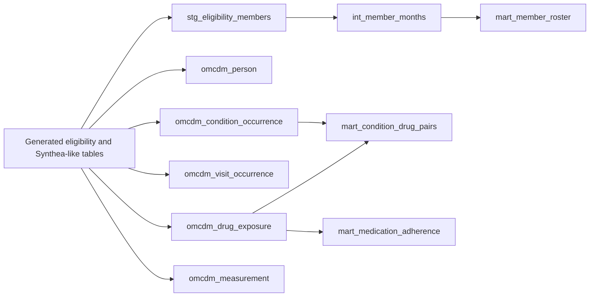
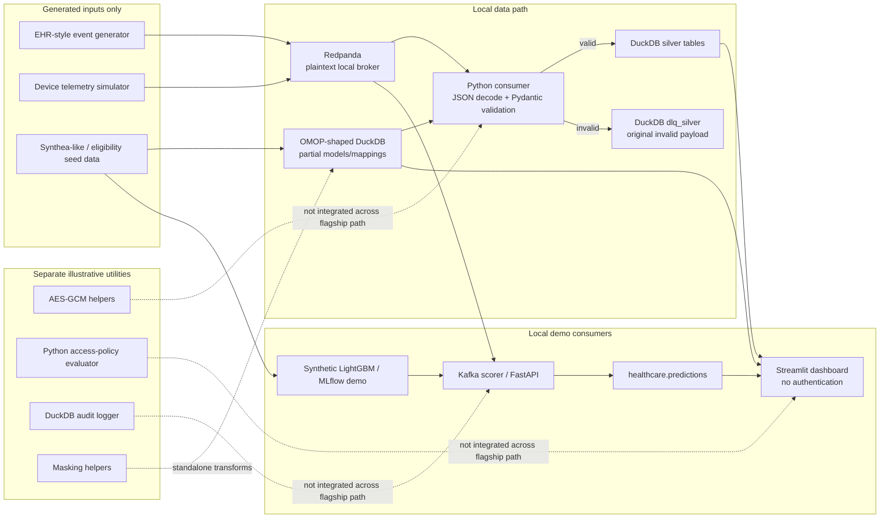
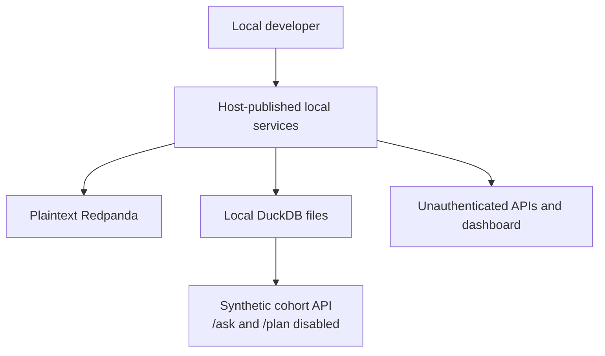

# Local synthetic prototype architecture

This diagram describes only the locally implemented portfolio path. Dashed edges
represent optional or illustrative integrations that are not enforced end to end.

## Local batch/dbt lineage

Source links:

- [`dbt_project/models/staging/stg_eligibility_members.sql`](../dbt_project/models/staging/stg_eligibility_members.sql)
- [`dbt_project/models/intermediate/int_member_months.sql`](../dbt_project/models/intermediate/int_member_months.sql)
- [`dbt_project/models/omop/omcdm_person.sql`](../dbt_project/models/omop/omcdm_person.sql)
- [`dbt_project/models/omop/omcdm_condition_occurrence.sql`](../dbt_project/models/omop/omcdm_condition_occurrence.sql)
- [`dbt_project/models/omop/omcdm_visit_occurrence.sql`](../dbt_project/models/omop/omcdm_visit_occurrence.sql)
- [`dbt_project/models/omop/omcdm_drug_exposure.sql`](../dbt_project/models/omop/omcdm_drug_exposure.sql)
- [`dbt_project/models/omop/omcdm_measurement.sql`](../dbt_project/models/omop/omcdm_measurement.sql)
- [`dbt_project/models/marts/mart_member_roster.sql`](../dbt_project/models/marts/mart_member_roster.sql)
- [`dbt_project/models/marts/mart_condition_drug_pairs.sql`](../dbt_project/models/marts/mart_condition_drug_pairs.sql)
- [`dbt_project/models/marts/mart_medication_adherence.sql`](../dbt_project/models/marts/mart_medication_adherence.sql)

This is source lineage, not a claim that every edge has a tracked end-to-end run.

## Trust boundaries

- All input is synthetic. Real patient records and PHI are outside the supported
  boundary.
- Local ports, plaintext broker traffic, development credentials, and generated keys
  are suitable only for an isolated development environment.
- In the coordinated SQL-boundary patch, `/ask` and `/plan` are disabled. `/cohort`
  uses bounded, application-owned parameterized SQL over synthetic data, and no
  row-level cohort result is sent to an external model. The API remains
  unauthenticated and local-only.
- Quarantine records contain original invalid payloads and require the same local
  protection as the source stream.
- Governance utilities are shown separately because the primary producer, consumer,
  scorer, and dashboard do not consistently invoke them.

## Evidence boundaries

- Pydantic event validation and DuckDB writes are implemented in
  `streaming/consumers/glue_etl_job.py` local mode.
- Invalid records are written to `dlq_silver`; the `healthcare.dlq` Kafka topic is
  configured but not used by that consumer.
- No broker-backed artifact demonstrates duplicate policy, checkpoint restart,
  compatibility changes, loss, latency, or quarantine rate.
- The ML path is a generated-data software demo and is not clinically validated or
  intended for diagnosis, treatment, or triage.
- The security utilities and local tests do not constitute a HIPAA compliance
  determination, deployment assessment, or control integration proof.
